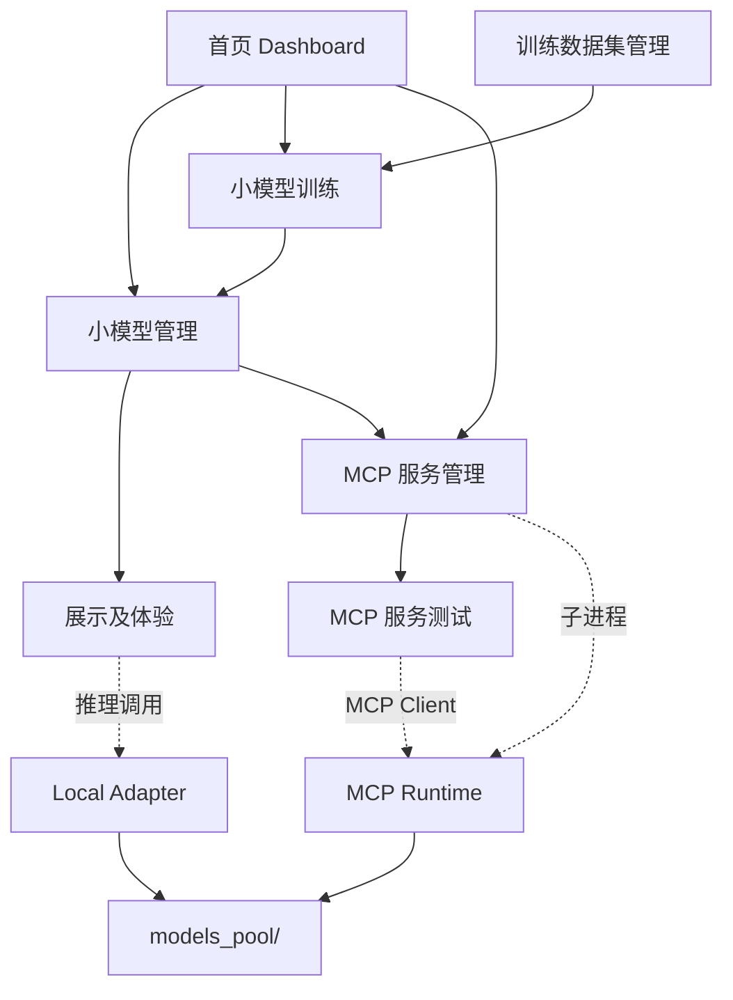
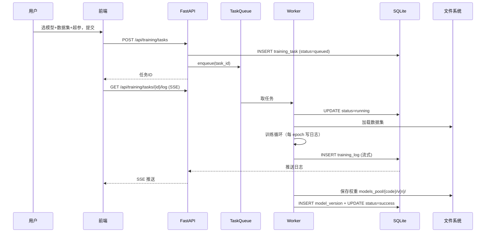
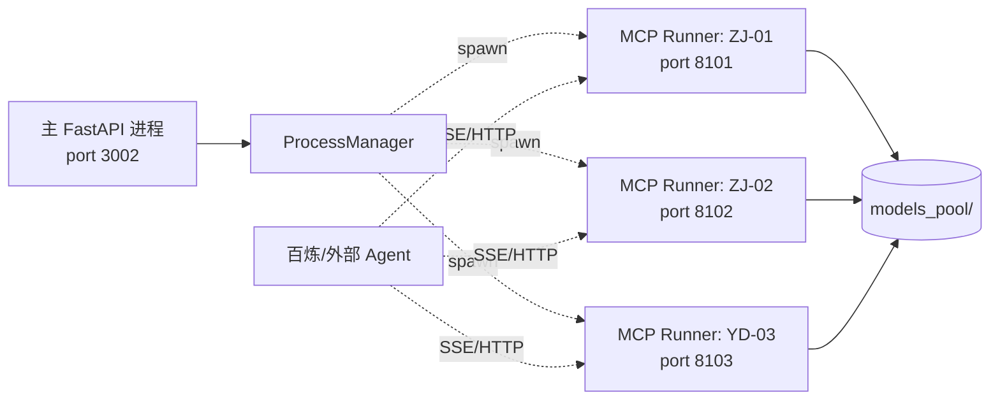
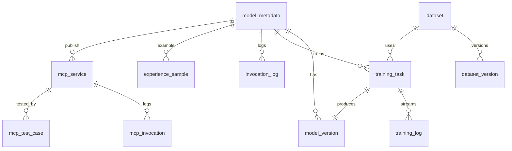

# 用电公司小模型能力展示平台 · 设计与技术方案

> 版本：v2.0（含 7 大功能模块融合）
> 分支：`dev-algomodel`
> 适用阶段：MVP（演示与体验优先）

---

## 一、决策基线

| # | 决策点 | 落地约束 |
|---|---|---|
| 1 | Git 分支 | 本地分支 `dev-algomodel`，已配置 |
| 2 | 数据存储 | **SQLite + 本地文件**（不引入 PostgreSQL/Redis） |
| 3 | 模型服务调用 | **直接调用本地 Python 函数**，不通过 docker SDK 拉起容器 |
| 4 | 用户权限 | 不接入鉴权（单用户演示） |
| 5 | 推理设备 | **全部 CPU 推理**（沿用 PyTorch CPU / xgboost-cpu 规范） |
| 6 | 小模型清单 | **20 个，分 6 大场景**（详见第三节） |

---

## 二、平台功能架构

平台包含 7 大功能模块：**首页、小模型管理、小模型训练、小模型展示及体验、训练数据集管理、小模型 MCP 服务管理、小模型 MCP 服务测试**。

### 2.1 模块依赖关系图



### 2.2 路由总览（前端）

```
/                           首页
/models                     小模型管理（20 个模型清单）
/models/:code               小模型详情
/training                   训练任务列表
/training/new               创建训练任务
/training/:taskId           训练任务详情（曲线/日志/参数）
/experience                 展示及体验（按场景下钻）
/experience/:code           单模型在线体验
/datasets                   训练数据集管理
/datasets/:dsId             数据集详情/预览
/mcp                        MCP 服务管理
/mcp/:serviceId             MCP 服务配置详情
/mcp/test                   MCP 服务测试
```

---

## 三、小模型清单（6 场景 / 20 模型）

### 3.1 采集自愈场景（5 个）

| 编号 | 名称 | I/O 类型 | 后端绑定 |
|---|---|---|---|
| ZJ-01 | 终端健康评价模型 | timeseries | 本地推理（`terminal_xgb_model.joblib`） |
| ZJ-02 | 电表健康评价模型 | timeseries | 本地推理（`meter_cnn_lstm_model.pt`） |
| ZJ-03 | 主站异常研判模型 | tabular | 本地推理 |
| ZJ-04 | 采集策略智能调度模型 | tabular | 本地推理 |
| ZJ-05 | 采集链路故障诊断模型（终端+电表节点） | multimodal | 本地推理 |

### 3.2 现场作业场景（2 个）

| 编号 | 名称 | I/O 类型 | 后端绑定 |
|---|---|---|---|
| XC-01 | 拆除旧表作业识别 | image | 本地推理 |
| XC-02 | 安装新表作业识别 | image | 本地推理 |

### 3.3 负荷资源管理（3 个）

| 编号 | 名称 | I/O 类型 | 备注 |
|---|---|---|---|
| FH-01 | 负荷资源可调能力评估 | timeseries | 含**空调/储能/光伏/充换电/工业** 5 子场景切换 |
| FH-02 | 运营商申报策略推荐 | tabular | — |
| FH-03 | 运营商调控策略推荐 | tabular | — |

### 3.4 台区四精管理（5 个）

| 编号 | 名称 | I/O 类型 |
|---|---|---|
| TQ-01 | 台区负载率预测 | timeseries |
| TQ-02 | 台区功率因数预测 | timeseries |
| TQ-03 | 台区三相不平衡度预测 | timeseries |
| TQ-04 | 用户停电风险等级研判 | tabular |
| TQ-05 | 用户电能质量评价 | timeseries |

### 3.5 用电异常监控（4 个）

| 编号 | 名称 | I/O 类型 | 后端绑定 |
|---|---|---|---|
| YD-01 | 漏电分析 | timeseries | 本地推理 |
| YD-02 | 烧表防治 | timeseries | 本地推理 |
| YD-03 | 电采暖高价低接研判 | timeseries | 本地推理（heating_fraud 训练产物） |
| YD-04 | 计量失准 | timeseries | 本地推理 |

### 3.6 资产管理场景（1 个）

| 编号 | 名称 | I/O 类型 |
|---|---|---|
| ZC-01 | 逆变器光伏铭牌识别 | image |

---

## 四、模块详细设计

### 4.1 模块 ① 首页 `/`

**目标**：一屏概览全平台运行态势。

**布局**：
| 区块 | 内容 |
|---|---|
| 顶部统计卡（6 张） | 场景数(6)、小模型数(20)、运行中模型、训练中任务、已发布 MCP 服务、今日调用 |
| 6 大场景概览卡片 | 每个场景显示模型数 / 在线率 / 今日调用，点击进入 `/experience/:scene` |
| 调用趋势折线图 | `invocation_log` 近 24h 按 5min 聚合 |
| 服务流量分布饼图 | TOP 8 模型今日调用占比 |
| 最近训练任务（5 条） | 任务名 / 模型 / 状态 / 进度条 |
| 最近 MCP 调用（5 条） | 服务名 / 来源 IP / 时延 / 状态 |
| 操作日志（5 条） | 操作人 / 操作类型 / 时间 |

**后端 API**：
```
GET /api/dashboard/stats         → 6 张统计卡数据
GET /api/dashboard/scene-summary → 6 大场景汇总
GET /api/dashboard/invoke-trend  → 调用趋势（?range=24h&granularity=5m）
GET /api/dashboard/recent        → 最近训练/MCP/日志
```

---

### 4.2 模块 ② 小模型管理 `/models`

**目标**：登记、查看、编辑、上下线 20 个小模型。

**列表页字段**：
| 字段 | 说明 |
|---|---|
| 编码 | ZJ-01 等 |
| 名称 / 场景 | 中文名 + 场景 tag |
| 输入类型 | 时序/图片/表格/多模态 |
| 关联数据集 | 引用 `dataset` 表 |
| 当前版本 | 如 `v1.2.0`（来自最新训练任务） |
| 状态 | 运行中 / 待训练 / 已下线 / 异常 |
| MCP 服务 | 已发布 / 未发布 |
| 操作 | 详情 / 训练 / 体验 / 发布 MCP / 下线 |

**详情页 Tab**：
1. **基本信息**：编码、名称、描述、I/O Schema、推理设备(CPU)、权重路径
2. **版本历史**：`model_version` 表，支持回滚
3. **关联数据集**：可切换/绑定数据集
4. **关联训练任务**：跳转 `/training/:taskId`
5. **关联 MCP 服务**：跳转 `/mcp/:serviceId`

**后端 API**：
```
GET    /api/models                 # 列表（支持 ?scene=&status=）
GET    /api/models/{code}          # 详情
PUT    /api/models/{code}          # 更新元信息
POST   /api/models/{code}/online
POST   /api/models/{code}/offline
GET    /api/models/{code}/versions
POST   /api/models/{code}/rollback?version=
```

---

### 4.3 模块 ③ 小模型训练 `/training`

**目标**：可视化提交训练任务、监控进度、管理产物。

**关键设计原则**：
- MVP 阶段训练**异步执行**（FastAPI BackgroundTask + asyncio.Queue），**不引入 Celery**
- 每个模型类型对应一个**训练脚手架**（Python 脚本路径），平台只负责调度+日志收集
- 训练产物自动写入 `models_pool/{code}/v{n}/` 并登记 `model_version`

**训练任务时序**：



**新建训练任务表单**：
- 模型选择（下拉，绑定 20 个小模型，自动加载训练脚手架和默认超参）
- 数据集选择（下拉 datasets 列表 + I/O 类型必须匹配）
- 超参配置（动态表单，从脚手架元数据读取）
- 评估集划分比例
- 是否自动注册为新版本（默认是）

**任务详情页**：
- 实时日志（SSE 流式拉取 `training_log`）
- 训练曲线（loss / metric 折线图）
- 超参快照
- 产物文件列表（权重 / scaler / metrics.json）
- 操作：取消 / 重跑 / 导出产物

**后端 API**：
```
POST /api/training/tasks               # 创建任务
GET  /api/training/tasks               # 列表
GET  /api/training/tasks/{id}          # 详情
GET  /api/training/tasks/{id}/log      # SSE
POST /api/training/tasks/{id}/cancel
GET  /api/training/scaffolds/{code}    # 获取脚手架超参定义
```

---

### 4.4 模块 ④ 小模型展示及体验 `/experience`

**目标**：业务/客户视角，按场景浏览并在线试用模型。

**两级页面**：

**A. 场景广场页 `/experience`**：
- 6 张大卡片（采集自愈 / 现场作业 / 负荷资源 / 台区四精 / 用电异常 / 资产管理）
- 每张卡片显示：场景图 + 模型数 + "查看详情"按钮

**B. 单模型体验页 `/experience/:code`**：

按 `io_type` 动态渲染输入区：

| io_type | 输入区 | 输出区 |
|---|---|---|
| timeseries | CSV 上传 / 在线粘贴 / 选择"示例数据" / 时间范围 | 时序图 + 推理结果卡 + 处置建议 |
| image | 拖拽上传 / 摄像头实时帧 | 框选标注图 + 类别概率 + 阈值滑块 |
| tabular | 动态表单（按 inputSpec 生成） | 结果表 + 关键特征贡献条 |
| multimodal | 多 tab 输入 | 综合结果 |

特殊：FH-01 增加 **5 子场景切换**（空调/储能/光伏/充换电/工业）。

**统一调用接口**：`POST /api/predict/{code}`，内部走 `local_adapter`。

**结果页附带**：
- LLM 解读按钮（调用既有 `chat.py` 用 Qwen 解读结果）
- "保存为示例"按钮（写入 `experience_sample` 表）

---

### 4.5 模块 ⑤ 训练数据集管理 `/datasets`

**目标**：登记、上传、版本化训练数据集；与训练任务双向绑定。支持 ZIP 压缩包上传、YOLO 目标检测标注预览。

**列表页字段**：
- 数据集 ID / 名称 / 场景 / 关联模型编码 / 格式 / 类型（通用 / YOLO 目标检测）
- 样本数/文件数/图片数/标注框数 / 大小 / 版本 / 创建时间

**详情页 Tab**：
1. **基本信息**：名称、场景、关联模型、格式、类型、描述、版本、统计数字
2. **样本预览**（按 `dataset_type` 区分）：
   - 通用 CSV：DataTable（前 50 行）
   - 通用图片：缩略图网格
   - YOLO 目标检测：Canvas 叠加检测框 + 类别标签，支持分页与点击放大
3. **统计信息**：CSV→缺失率；YOLO→每类标注框数量分布柱状图
4. **版本历史**：版本列表，支持删除旧版本

**上传方式**：
- **ZIP 压缩包**为主，上传后自动解压至目标目录
- 一个场景 + 一个模型编码 = 一个数据集目录
- 目录结构：`backend/data/datasets/{scene}/{model_code}/`

**YOLO 数据集规范**：
- ZIP 根目录包含 `images/` 和 `labels/` 子目录
- `labels/` 下每张图片对应同名 `.txt`，每行 `class_id cx cy w h`（归一化）
- 可选 `classes.txt`（类别名）或 `dataset.yaml`
- 上传时自动识别 YOLO 格式

**存储**：
- 元数据 → SQLite（`dataset` + `dataset_version` 表）
- 文件 → `backend/data/datasets/{scene}/{model_code}/`（gitignore）

**后端 API**：
```
GET    /api/datasets                              # 列表（?scene=&format=&dataset_type=&model_code=）
POST   /api/datasets                              # 创建（multipart/form-data，ZIP 上传）
GET    /api/datasets/{id}                         # 详情
DELETE /api/datasets/{id}                         # 删除（级联删除文件）
POST   /api/datasets/{id}/versions                # 上传新 ZIP 版本
DELETE /api/datasets/{id}/versions/{vid}          # 删除指定版本
GET    /api/datasets/{id}/preview                 # 通用预览
GET    /api/datasets/{id}/yolo-preview?page=&size= # YOLO 标注预览（分页）
GET    /api/datasets/{id}/files/{path}            # 静态文件访问
GET    /api/datasets/{id}/stats                   # 统计信息
```

---

### 4.6 模块 ⑥ 小模型 MCP 服务管理 `/mcp`

**目标**：将训练好的本地小模型一键封装为对外 MCP 服务（SSE / streamable-http），供第三方 AI Agent / 百炼平台调用。

> **关键认识**：平台**内部推理仍走本地函数调用**（不变）；MCP 服务是**对外暴露能力**的另一条路径，二者并行不冲突。

**MCP 服务进程拓扑**：



**列表页字段**：
- 服务 ID / 关联模型(code) / 协议(sse/streamable-http) / 端口 / 状态(运行/停止) / 启动时间 / 今日调用 / 操作

**详情页**：
- 配置：协议、Host(默认 0.0.0.0)、Port、传输路径(/sse 或 /mcp)、并发上限
- 工具(tool)定义：自动生成 FastMCP `@mcp.tool()` 函数签名（基于模型 inputSpec/outputSpec）
- 客户端配置示例：
  - 百炼平台 JSON（`mcp_config_bailian_sse.json` 模板）
  - 通用 MCP Client JSON
- 操作：启动 / 停止 / 重启 / 查看日志 / 复制配置

**实现要点**：
- 每个 MCP 服务对应一个**子进程**（subprocess.Popen 启动 `python -m app.mcp_runtime.runner --code ZJ-01 --port 8101`）
- 主 FastAPI 进程仅做**进程编排**与日志聚合
- 端口分配：默认从 8100 起，避免与主服务 3002 冲突
- 子进程崩溃自动重启（最多 3 次），状态写回 SQLite

**后端 API**：
```
GET    /api/mcp/services
POST   /api/mcp/services                    # body: {model_code, transport, port}
GET    /api/mcp/services/{id}
POST   /api/mcp/services/{id}/start
POST   /api/mcp/services/{id}/stop
GET    /api/mcp/services/{id}/log           # SSE
GET    /api/mcp/services/{id}/config?platform=bailian
DELETE /api/mcp/services/{id}
```

---

### 4.7 模块 ⑦ 小模型 MCP 服务测试 `/mcp/test`

**目标**：内置一个 MCP Client 调试台，验证已发布服务的连通性、工具签名与响应。

**页面布局**：
```
┌──────────────────────────────────────────────────────┐
│ [选择服务 ▼ ZJ-01@8101]  [刷新工具列表]              │
├──────────────────────────────────────────────────────┤
│ 工具列表(左 30%)         │ 调用区(右 70%)            │
│  ◯ predict_health        │ Tool: predict_health      │
│  ◯ batch_predict         │ ──────────────────────── │
│                          │ 参数表单(自动生成)         │
│                          │   data: [Textarea/Upload]  │
│                          │   threshold: 0.5           │
│                          │ ──────────────────────── │
│                          │ [发送]  [生成 cURL]        │
│                          │ ──────────────────────── │
│                          │ 响应: 时延 134ms           │
│                          │ {"prediction": 1, ...}     │
│                          └────────────────────────── │
└──────────────────────────────────────────────────────┘
```

**功能项**：
1. **服务选择**：拉取 `mcp_service.status='running'` 列表
2. **连通性自检**：握手 + tool list 拉取
3. **工具调用**：参数表单自动从 tool schema 生成
4. **响应对比**：可同时调用"内部本地推理"与"MCP 服务"两条路径，比对结果一致性
5. **保存测试用例**：写入 `mcp_test_case` 表，便于回归测试
6. **导出 cURL / Python**：方便外部复用

**后端 API**：
```
GET  /api/mcp/test/services             # 可测试服务列表
POST /api/mcp/test/handshake?service_id=
POST /api/mcp/test/invoke               # body: {service_id, tool, args}
GET  /api/mcp/test/cases
POST /api/mcp/test/cases
POST /api/mcp/test/cases/{id}/replay
```

---

## 五、后端目录结构

```
backend/app/
├── api/routes/
│   ├── dashboard.py          # 模块 1
│   ├── models.py             # 模块 2
│   ├── training.py           # 模块 3
│   ├── predict.py            # 模块 4（统一推理入口）
│   ├── experience.py         # 模块 4（示例样本管理）
│   ├── datasets.py           # 模块 5
│   ├── mcp_services.py       # 模块 6
│   ├── mcp_test.py           # 模块 7
│   └── chat.py               # 既有：LLM 解读
├── adapters/
│   ├── base.py               # ModelAdapter 抽象基类
│   ├── local_adapter.py      # 加载本地 .joblib/.pt 推理
│   └── mock_adapter.py       # 未上线模型返回示例数据
├── trainers/                 # 训练脚手架
│   ├── base_trainer.py
│   ├── timeseries_trainer.py # ZJ/TQ/YD 时序类
│   ├── image_trainer.py      # XC/ZC 视觉类
│   └── tabular_trainer.py    # 表格类
├── mcp_runtime/              # MCP 子进程编排
│   ├── runner.py             # 入口：python -m app.mcp_runtime.runner --code ...
│   ├── tool_factory.py       # 根据 inputSpec 生成 @mcp.tool()
│   ├── client.py             # 测试模块用的 MCP Client 封装
│   └── process_manager.py    # 子进程编排/守护
├── registry/
│   └── model_registry.py     # 20 个小模型登记
├── db/
│   ├── database.py           # SQLAlchemy + aiosqlite
│   └── models.py             # ORM 模型
├── core/config.py
├── schemas/                  # Pydantic 数据模型
└── main.py

backend/data/                 # 运行时数据（gitignore）
├── model_show.db
├── datasets/{ds_id}/v{n}/
├── uploads/
└── mcp_logs/

backend/models_pool/          # 模型权重根目录
└── {code}/v{n}/{artifact}
```

---

## 六、SQLite Schema 总览

### 6.1 ER 关系图



### 6.2 表结构

```sql
-- 模型元数据（启动时从 model_registry.py 同步）
CREATE TABLE model_metadata (
    code TEXT PRIMARY KEY,
    name TEXT NOT NULL,
    scene TEXT NOT NULL,             -- ZJ/XC/FH/TQ/YD/ZC
    io_type TEXT NOT NULL,           -- timeseries/image/tabular/multimodal
    backend_type TEXT DEFAULT 'local',
    description TEXT,
    input_spec TEXT,                 -- JSON
    output_spec TEXT,                -- JSON
    sub_scenes TEXT,                 -- JSON 数组（仅 FH-01 用）
    current_version TEXT,
    status TEXT DEFAULT 'planned',   -- running/planned/offline/error
    updated_at TIMESTAMP
);

-- 模型版本
CREATE TABLE model_version (
    id INTEGER PRIMARY KEY AUTOINCREMENT,
    model_code TEXT NOT NULL,
    version TEXT NOT NULL,
    artifact_path TEXT,
    metrics TEXT,                    -- JSON
    training_task_id INTEGER,
    is_active INTEGER DEFAULT 0,
    created_at TIMESTAMP
);

-- 数据集
CREATE TABLE dataset (
    id INTEGER PRIMARY KEY AUTOINCREMENT,
    name TEXT NOT NULL,
    scene TEXT NOT NULL,
    model_code TEXT,
    format TEXT NOT NULL,              -- csv/txt/jpg/png/mp4/zip
    dataset_type TEXT DEFAULT 'general', -- general / yolo_detection
    description TEXT,
    schema_json TEXT,
    classes_json TEXT,                 -- YOLO 类别名 JSON
    image_count INTEGER DEFAULT 0,
    label_count INTEGER DEFAULT 0,
    sample_count INTEGER DEFAULT 0,
    file_count INTEGER DEFAULT 0,
    size_bytes INTEGER DEFAULT 0,
    current_version TEXT,
    created_at TIMESTAMP,
    updated_at TIMESTAMP
);

CREATE TABLE dataset_version (
    id INTEGER PRIMARY KEY AUTOINCREMENT,
    dataset_id INTEGER NOT NULL,
    version TEXT NOT NULL,
    file_path TEXT,
    file_count INTEGER DEFAULT 0,
    sample_count INTEGER DEFAULT 0,
    size_bytes INTEGER DEFAULT 0,
    created_at TIMESTAMP
);

-- 训练任务
CREATE TABLE training_task (
    id INTEGER PRIMARY KEY AUTOINCREMENT,
    model_code TEXT NOT NULL,
    dataset_id INTEGER NOT NULL,
    hyperparams TEXT,
    status TEXT,                     -- queued/running/success/failed/cancelled
    progress REAL DEFAULT 0,
    metrics TEXT,
    artifact_path TEXT,
    started_at TIMESTAMP,
    finished_at TIMESTAMP,
    error_msg TEXT
);

CREATE TABLE training_log (
    id INTEGER PRIMARY KEY AUTOINCREMENT,
    task_id INTEGER NOT NULL,
    level TEXT,
    message TEXT,
    logged_at TIMESTAMP DEFAULT CURRENT_TIMESTAMP
);

-- 推理调用
CREATE TABLE invocation_log (
    id INTEGER PRIMARY KEY AUTOINCREMENT,
    model_code TEXT NOT NULL,
    request_id TEXT,
    latency_ms INTEGER,
    success INTEGER,
    error_msg TEXT,
    invoked_at TIMESTAMP DEFAULT CURRENT_TIMESTAMP
);
CREATE INDEX idx_log_invoked_at ON invocation_log(invoked_at);
CREATE INDEX idx_log_model_code ON invocation_log(model_code);

-- 体验示例
CREATE TABLE experience_sample (
    id INTEGER PRIMARY KEY AUTOINCREMENT,
    model_code TEXT,
    title TEXT,
    input_payload TEXT,
    output_snapshot TEXT,
    created_at TIMESTAMP
);

-- MCP 服务
CREATE TABLE mcp_service (
    id INTEGER PRIMARY KEY AUTOINCREMENT,
    model_code TEXT NOT NULL,
    model_version TEXT,
    transport TEXT,                  -- sse / streamable-http
    host TEXT DEFAULT '0.0.0.0',
    port INTEGER UNIQUE,
    status TEXT,                     -- stopped/running/error
    pid INTEGER,
    started_at TIMESTAMP,
    last_error TEXT,
    created_at TIMESTAMP
);

CREATE TABLE mcp_invocation (
    id INTEGER PRIMARY KEY AUTOINCREMENT,
    service_id INTEGER,
    client_ip TEXT,
    tool_name TEXT,
    latency_ms INTEGER,
    success INTEGER,
    invoked_at TIMESTAMP DEFAULT CURRENT_TIMESTAMP
);

CREATE TABLE mcp_test_case (
    id INTEGER PRIMARY KEY AUTOINCREMENT,
    service_id INTEGER,
    name TEXT,
    tool_name TEXT,
    args_json TEXT,
    expected_json TEXT,
    last_result_json TEXT,
    last_status TEXT,
    created_at TIMESTAMP
);

-- 操作日志
CREATE TABLE operation_log (
    id INTEGER PRIMARY KEY AUTOINCREMENT,
    actor TEXT,
    action TEXT,
    target TEXT,
    detail TEXT,
    occurred_at TIMESTAMP DEFAULT CURRENT_TIMESTAMP
);
```

数据库文件：`backend/data/model_show.db`（gitignore）。

---

## 七、推理与发布数据流

```mermaid
graph TB
    subgraph 前端
        UI[Vue3 体验页]
        TestUI[MCP 测试台]
    end

    subgraph 主进程 FastAPI
        Predict[/api/predict/code]
        MCPMgr[mcp_services.py]
        Local[Local Adapter]
        PM[ProcessManager]
    end

    subgraph 子进程
        Runner[mcp_runtime/runner.py]
        FastMCP[FastMCP Server]
    end

    subgraph 存储
        Pool[(models_pool/)]
        DB[(SQLite)]
    end

    UI -->|HTTP| Predict
    Predict --> Local
    Local --> Pool
    Local --> DB

    MCPMgr --> PM
    PM -.spawn.-> Runner
    Runner --> FastMCP
    FastMCP --> Pool
    FastMCP --> DB

    TestUI -->|MCP Client| FastMCP
    External[百炼/外部 Agent] -->|SSE/HTTP| FastMCP
```

---

## 八、依赖清单

### 8.1 backend/requirements.txt

```
# Web 框架
fastapi>=0.115.0
uvicorn[standard]>=0.30.0
python-multipart>=0.0.12
python-dotenv>=1.0.1
pydantic>=2.0.0
pydantic-settings>=2.0.0
aiofiles>=23.0.0

# 数据库
sqlalchemy>=2.0.0
aiosqlite>=0.20.0

# 推理与训练（CPU）
joblib>=1.5.0
scikit-learn>=1.4.0
xgboost-cpu>=2.1.0
torch>=2.1.0
numpy>=1.26.0
pandas>=2.2.0
pyarrow>=15.0.0
pillow>=10.0.0

# MCP（模块 6/7）
mcp>=1.0.0
httpx>=0.27.0

# LLM 解读
openai>=1.50.0
```

### 8.2 frontend/package.json（无新增）

复用 vue-router、element-plus、echarts、sass。

---

## 九、模型注册表样例

```python
# backend/app/registry/model_registry.py
MODEL_REGISTRY = {
    "ZJ-01": {
        "name": "终端健康评价模型",
        "scene": "ZJ",
        "io_type": "timeseries",
        "backend_type": "local",
        "weight_path": "models_pool/ZJ-01/v1/terminal_xgb_model.joblib",
        "loader": "joblib",
        "input_spec": [
            {"field": "data", "type": "csv|json", "required": True},
        ],
        "output_spec": [
            {"field": "prediction", "description": "0=健康 1=异常"},
            {"field": "score", "description": "异常概率"},
        ],
        "status": "running",
    },
    "ZJ-02": {
        "name": "电表健康评价模型",
        "scene": "ZJ",
        "io_type": "timeseries",
        "backend_type": "local",
        "weight_path": "models_pool/ZJ-02/v1/meter_cnn_lstm_model.pt",
        "loader": "torch_cpu",
        "status": "running",
    },
    "YD-03": {
        "name": "电采暖高价低接研判",
        "scene": "YD",
        "io_type": "timeseries",
        "backend_type": "local",
        "weight_path": "models_pool/YD-03/v1/heating_fraud.joblib",
        "loader": "joblib",
        "status": "running",
    },
    "FH-01": {
        "name": "负荷资源可调能力评估",
        "scene": "FH",
        "io_type": "timeseries",
        "backend_type": "local",
        "sub_scenes": ["空调", "储能", "光伏", "充换电", "工业"],
        "status": "planned",
    },
    # ... 其余 16 个按相同模板登记
}
```

未集成的模型 `status='planned'` 走 `mock_adapter`，前端正常展示。

---

## 十、里程碑

| 里程碑 | 范围 | 完成判定 |
|---|---|---|
| **M1 骨架** | 6 场景路由 + 20 模型卡片（mock）+ SQLite + invocation_log + 模型注册表 | 前端可浏览全部 20 个模型 |
| **M2 体验闭环** | 模块 ④ 展示及体验完整可用，3 个核心模型出真实结果（YD-03、ZJ-01、ZJ-02） | 体验页可推理 |
| **M3 数据集 + 训练** | 模块 ⑤ + ③，跑通至少 1 个模型的端到端训练 | 训练任务能产出新版本 |
| **M4 模型管理** | 模块 ② 版本/上下线/回滚 | 多版本切换正常 |
| **M5 MCP 发布与测试** | 模块 ⑥ + ⑦，至少发布 3 个模型为 MCP 并通过测试台验证 | 百炼平台可调用 |
| **M6 全场景闭环** | 20 个模型全部经历：登记 → 数据集 → 训练 → 上线 → 体验 → MCP 发布 | 全流程可演示 |

---

## 十一、与既有项目衔接

| 现有资源 | 接入方式 |
|---|---|
| `f:/qoderproject/heating_fraud/` 训练产物 | 导出为 `YD-03/v1/heating_fraud.joblib` 拷至 `models_pool/`，**不再启动 MCP 服务**（由本平台模块 ⑥ 统一发布） |
| `电表mcp镜像/meter_cnn_lstm_model.pt` | 拷贝至 `models_pool/ZJ-02/v1/`，本地推理 |
| `终端mcp镜像/terminal_xgb_model.joblib` | 拷贝至 `models_pool/ZJ-01/v1/`，本地推理 |
| `power_verification/algorithms/` | XC-01/02 改造为本地 Python 函数，由 `local_adapter` 直接调用 |
| `measure_asset_prediction/` | 离线训练后台，不直接绑定 20 个小模型 |

---

## 十二、风险与注意事项

| 风险 | 缓解措施 |
|---|---|
| 多模型同进程加载内存峰值 | 懒加载（首次调用 `joblib.load` / `torch.load`），按 LRU 缓存上限 5 个模型 |
| 训练任务阻塞主事件循环 | 使用 `asyncio.run_in_executor` 或独立 Worker 进程池 |
| MCP 子进程端口冲突 | 启动前检测 `mcp_service.port` 唯一性 + 端口可用性 |
| MCP 子进程崩溃 | ProcessManager 守护 + 自动重启（≤3 次） + 状态写回 SQLite |
| 数据集大文件上传超时 | 分片上传 + `aiofiles` 异步写入；MVP 阶段建议 < 200MB |
| SQLite 并发写入瓶颈 | 启用 WAL 模式 + 单写多读，MVP 阶段足够 |

---

## 附录 A：环境变量

| 变量 | 说明 | 默认值 |
|---|---|---|
| `DASHSCOPE_API_KEY` | 阿里云百炼 API Key（LLM 解读用） | 必填 |
| `DASHSCOPE_BASE_URL` | API 地址 | `https://dashscope.aliyuncs.com/compatible-mode/v1` |
| `SERVER_PORT` | 后端端口 | `3002` |
| `CORS_ORIGIN` | 允许跨域来源 | `*` |
| `DATA_DIR` | 数据根目录 | `./data` |
| `MODELS_POOL_DIR` | 模型权重根目录 | `./models_pool` |
| `MCP_PORT_RANGE` | MCP 子进程端口范围 | `8100-8199` |

## 附录 B：快速启动

详见 [README.md](./README.md)。
